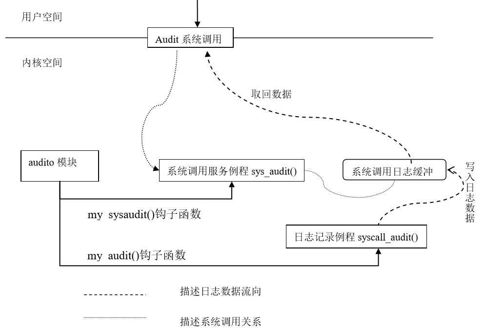

## 6.6 实例-系统调用日志收集系统

&emsp;&emsp;系统调用是用户程序与系统打交道的唯一入口，因此对系统调用的安全调用直接关系到系统的安全，但对系统管理员来说，某些操作却会给系统管理带来麻烦，比如一个用户恶意地不断调用fork()将导致系统负载增加，所以如果我们能收集到是谁调用了一些有危险的系统调用，以及调用系统调用的时间和其他信息，将有助于系统管理员进行事后追踪，从而提高系统的安全性。。

&emsp;&emsp;本实例收集Linux系统运行时系统调用被执行的信息，也就是实时获取系统调用日志，这些日志信息将以可读的形式实时地返回到用户空间，以便做为系统管理或者系统安全分析时的参考数据。

&emsp;&emsp;本实例需要完成以下几个基本功能：

第一：记录系统调用日志，将其写入缓冲区（内核中），以便用户读取；

第二：建立新的系统调用，以便将内核缓冲中的系统调用日志返回到用户空间。

第三：循环利用系统调用，以便能动态实时返回系统调用的日志。

### 6.6.1 代码结构体系介绍

&emsp;&emsp;上面介绍的基本功能对应程序代码中的三个子程序，它们分别是模块中的两个例程
syscall_audit()和mod_sys_audit()以及用户态程序auditd()，其中syscall_audit()和mod_sys_audit()编写在同一个模块中.
以下代码基于x86_64架构，3.10.0版本内核。

#### 1 日志记录例程syscall_audit()

&emsp;&emsp;syscall_audit()是一个内核态的服务例程，该例程负责记录系统调用的运行日志，包括调用时刻、调用者PID、程序名等，这些信息可从内核函数current_kernel_time()、current_uid()等获得。实际中，并不是对每一个系统调用信息都进行收集，只需要对系统影响较大的系统调用，比如fork(),clone(),open()等进行收集即可。

&emsp;&emsp;为了保证数据连续性，防止丢失，syscall_audit()建立了一个内核缓冲区存放每刻搜集到的日志数据。当搜集的数据量到达一定阀值时（比如到达缓冲区总大小的%80时），就唤醒系统调用所在进程取回数据。否则继续搜集，这时该例程会堵塞在一个等待队列上，直到被唤醒。

&emsp;&emsp;变量的申明和定义如下

```c
#include <linux/module.h>
#include <linux/init.h>
#include <linux/kernel.h>
#include <linux/types.h>
#include <linux/time.h>
#include <linux/cred.h>
#include <asm/current.h>
#include <linux/sched.h>
#include <asm/uaccess.h>

#define COMM_SIZE 16

struct syscall_buf {	/*定义缓冲区*/
    u32 serial;		/* 序列号 */
    u32 ts_sec;		/*秒 */
    u32 ts_nsec;	/* 纳秒 */
    u32 syscall;	/* 系统调用号 */
    u32 status;		/* 系统调用的状态 */
    pid_t pid;		/* 进程标识符 */
    uid_t uid;		/* 用户标识符 */
    u8 comm[COMM_SIZE];	/* 进程对应的程序名 */
};
DECLARE_WAIT_QUEUE_HEAD(buffer_wait);	/*申明并初始化等待队列buffer_wait*/

#define AUDIT_BUF_SIZE 100		/*缓冲区大小 */
static struct syscall_buf audit_buf[AUDIT_BUF_SIZE];	/*缓冲区变量audit_buf*/
static int current_pos = 0;		/*缓冲区中的位置 */
static u32 serial = 0;			/*序列号*/
```

代码如下：

```c
void syscall_audit(int syscall, int return_status)
{
    struct syscall_buf * ppb_temp;

    if(current_pos < AUDIT_BUF_SIZE) {
    	//以下代码是记录系统调用相关信息
        struct timespec xtime = current_kernel_time();
        ppb_temp = &audit_buf[current_pos];
        ppb_temp->serial = serial++;
        ppb_temp->ts_sec = xtime.tv_sec;
        ppb_temp->ts_nsec = xtime.tv_nsec;
        ppb_temp->syscall = syscall;
        ppb_temp->status = return_status;
        ppb_temp->pid = current->pid;
        ppb_temp->uid = current_uid().val;

        memcpy(ppb_temp->comm, current->comm, COMM_SIZE);

        if(current_pos++ == AUDIT_BUF_SIZE*8/10) {
            printk("IN MODULE_audit:yes, it near full\n");
            wake_up_interruptible(&buffer_wait);	/*唤醒在等待队列上等待的进程*/
        }
    }
}
```

#### 2 模块例程sys_audit()

&emsp;&emsp;由于系统调用是在内核中执行，因此其执行日志也应该在内核态收集。为此，我们需要编写一个模块函数将内核信息带回到用户空间，即sys_audit()，其功能是从缓冲区中取数据返回用户空间。

```c
int sys_audit(u8 type, u8 * us_buf, u16 us_buf_size, u8 reset)
{
    int ret = 0;
    if(!type) {
        if(__clear_user(us_buf, us_buf_size)) {	/ *清用户态缓冲区*/
            printk("Eror:claer_user\n");
            return 0;
        }
        printk("IN MOUDLE_systemcall:starting...\n");
        ret = wait_event_interruptible(buffer_wait, current_pos >= AUDIT_BUF_SIZE*8/10);
        printk("IN MOUDLE_systemcall:over, current_pos is %d\n", current_pos);
        if(__copy_to_user(us_buf, audit_buf, (current_pos)*sizeof(struct syscall_buf))) {	/*将日志拷贝到用户空间*/
            printk("Error:copy error\n");
            return 0;
        }
        ret = current_pos - 1;
        current_pos = 0;	/*清空缓冲区*/
    }
    return ret;
}
```

&emsp;&emsp;当收集的日志数量达到缓冲区总容量的80％时，则调用wait_event_interruptible()让进程在buffer_wait等待队列上等待。否则，调用__copy_to_user()把缓冲区当前位置中的日志信息拷贝到用户空间的缓冲区。最后，返回缓冲区的当前位置。

#### 3 模块的初始化和退出

&emsp;&emsp;为了在模块中能对syscall_audit()和sys_audit()函数动态加载和卸载，我们又定义了与这两个函数对应的钩子函数my_audit（）和my_sysaudit（）；它们的定义在另一个文件中（参见6.6.2节），于是在模块中，申明它们为外部函数。
```c
extern void (*my_audit)(int, int);
extern int (*my_sysaudit)(unsigned char, unsigned char *, unsigned short, unsigned char);
```
&emsp;&emsp;于是，模块的初始化和退出函数如下：

```c
static int __init audit_init(void)
{
    my_sysaudit = sys_audit;
    my_audit = syscall_audit;
    printk("Starting System Call Auditing\n");
    return 0;
}

static void __exit audit_exit(void)
{
    my_audit = NULL;
    my_sysaudit = NULL;
    printk("Exiting System Call Auditing\n");
    return;
}

module_init(audit_init);
module_exit(audit_exit);
MODULE_LICENSE("GPL");
```

#### 4 用户空间收集日志进程auditd 

&emsp;&emsp;我们需要一个用户空间进程来不断的调用audit()系统调用，取回系统中搜集到的系统调用日志信息。这里要说明的是，连续不断地调用日志序列对于分析入侵或系统行为等才有价值。

```c
#include <stdio.h>
#include <errno.h>
#include <signal.h>
#include <sys/resource.h>
#include <sys/syscall.h>
#include <sys/types.h>

typedef unsigned char u8;
typedef unsigned int u32;

#define COMM_SIZE 16

struct syscall_buf {
    u32 serial;
    u32 ts_sec;
    u32 ts_nsec;
    u32 syscall;
    u32 status;
    pid_t pid;
    uid_t uid;
    u8 comm[COMM_SIZE];
};

#define AUDIT_BUF_SIZE 100*sizeof(struct syscall_buf)

int main(int argc, char *argv[])
{
    u8 col_buf[AUDIT_BUF_SIZE];
    unsigned char reset = 1;
    int num = 0;
    struct syscall_buf *p;
    while(1) {
        num = syscall(325, 0, col_buf, AUDIT_BUF_SIZE, reset);
        printf("num:%d\n",num);
        u8 j = 0;
        int i;
        p = (struct syscall_buf *)col_buf;
        for(i = 0; i < num; i++) {
            printf("num[%d], serial:%d\t",i, p[i].serial);
            printf("syscall:%d\n", p[i].syscall);
            printf("ts_sec: %d\n", ((struct syscall_buf*)col_buf)[i].ts_sec);
            printf("status:%d\n", ((struct syscall_buf *)col_buf)[i].status);
            printf("pid:%d\n", ((struct syscall_buf *)col_buf)[i].pid);
            printf("uid:%d\n", ((struct syscall_buf *)col_buf)[i].uid);
            printf("comm:%s\n", ((struct syscall_buf *)col_buf)[i].comm);
        }
    }
    return 1;
}
```

<div style="text-align: center">

</div>

<center>图6.2 日志收集系统的代码结构</center>

### 6.6.2 把代码集成到内核中

&emsp;&emsp;除了上面介绍的内容外，还需要一些辅助性的工作，这些工作将帮助我们将上述代码灵活地结成一体，以完成需要的功能。

#### 1. 在系统调用表中添加相应表项

&emsp;&emsp;arch/x86/syscalls/syscall_64.tbl文件中含有系统调用表，在其中加入新的系统调用如下：
```c
320     common  kexec_file_load         sys_kexec_file_load
323     common  userfaultfd             sys_userfaultfd
# 以下是新添加的代码
324     common  mysyscall               sys_syscall_audit
325     common  myaudit                 sys_myaudit
```

#### 2. 添加函数声明

&emsp;&emsp;与6.5节中添加系统调用的步骤一样，打开include/linux/syscalls.h文件，添加系统调用处理函数声明，如下：
```c
# 在文件最后添加以下代码
asmlinkage void sys_syscall_audit(int syscall,int return_status);
asmlinkage int sys_myaudit(u8 type, u8 * us_buf, u16 us_buf_size, u8 reset);
```

#### 3. 修改系统调用入口

&emsp;&emsp;在arch/x86/kernel/entry_64.S中含有系统调用入口system_call，因此在该文件中添加如下代码：
```c
        ja badsys
        movq %r10,%rcx
        call *sys_call_table(,%rax,8)  # XXX:    rip relative
        movq %rax,RAX-ARGOFFSET(%rsp)
#以下代码为新添加代码
        cmpq $57,ORIG_RAX-ARGOFFSET(%rsp)       #比较调用号是否相等，57是fork的调用号
        je myauditsys                           #是fork调用则跳转到myauditsys1
        cmpq $2,ORIG_RAX-ARGOFFSET(%rsp)        #open
        je myauditsys
        cmpq $3,ORIG_RAX-ARGOFFSET(%rsp)        #close
        je myauditsys
        cmpq $59,ORIG_RAX-ARGOFFSET(%rsp)       #execv
        je myauditsys
        cmpq $39,ORIG_RAX-ARGOFFSET(%rsp)       #getpid
        je myauditsys
        cmpq $56,ORIG_RAX-ARGOFFSET(%rsp)       #clone
        je myauditsys
myaudit:
#添加代码段结束
```

&emsp;&emsp;以上代码保证在每次系统调用后都执行比较，如果系统调用号与我们要收集的系统调用号系统，则将调用myauditsys代码段，如下代码：
```c
        FIXUP_TOP_OF_STACK %r11, -ARGOFFSET
        jmp int_check_syscall_exit_work

#以下为新添加代码段
myauditsys:
    pushq %rax
    pushq %rdi
    pushq %rsi
    movq ORIG_RAX-ARGOFFSET+8*3(%rsp),%rdi
    movq RAX-ARGOFFSET+8*3(%rsp),%rsi
    call sys_syscall_audit
    popq %rsi
    popq %rdi
    popq %rax
    jmp myaudit
#新添加代码段结束
```
&emsp;&emsp;其中调用了我们编写的日志记录例程syscall_audit()。

#### 4. 添加自己的文件

&emsp;&emsp;在/arch/x86/kernel/目录下添加自己编写的myaudit.c文件，该文件包含的内容如下：

```c
#include <asm/uaccess.h>
#include <linux/proc_fs.h>
#include <linux/init.h>
#include <linux/types.h>
#include <asm/current.h>
#include <linux/sched.h>

void (* my_audit)(int, int) = 0;
asmlinkage void sys_syscall_audit(int syscall,int  return_status)
{
    if(my_audit)    //如果钩子函数没有挂在则输出printk信息
        return (* my_audit)(syscall, return_status);
    printk("IN KERNEL:%s(%d), syscall:%d, return:%d\n", current->comm,
                current->pid, syscall, return_status);
    return;
}

int (* my_sysaudit)(u8, u8 *, u16, u8) = 0;
asmlinkage int sys_myaudit(u8 type, u8 * us_buf, u16 us_buf_size, u8 reset)
{
    if(my_sysaudit)
        return (* my_sysaudit)(type, us_buf, us_buf_size, reset);
    printk("IN KERNEL:my system call sysaudit() working\n");
    return 0;
}

EXPORT_SYMBOL(my_audit);
EXPORT_SYMBOL(my_sysaudit);
```
&emsp;&emsp;末尾两句通过EXPORT_SYMBOL导出刚加入的函数名，以便其他内核函数调用，这两个钩子函数的实现我们放在了模块中。

&emsp;&emsp;从代码可以看出sycall_audit()和sys_audit()并没有实现而是用两个钩子函数my_audit()和my_sysaudit()作为替身。而这两个钩子函数my_audit()和my_sysaudit()被放在模块中去实现，这样可以动态加载，方便调式。代码的结构如图6.2所示。

#### 5. 修改Makefile文件

&emsp;&emsp;修改arch/x86/kernel/Makefile:

&emsp;&emsp;加入 obj-y +=myaudit.o，即告诉内核将模块myaudit.o编译进内核

#### 6. 编译并加载模块

&emsp;&emsp;insmod audit.o

#### 8. 重新编译内核

&emsp;&emsp;以centos7为例，需要依次执行以下语句：
```
make -j8	//根据cpu核心决定线程数量
make bzImage
make modules
sudo make modules_install
sudo make install
```
